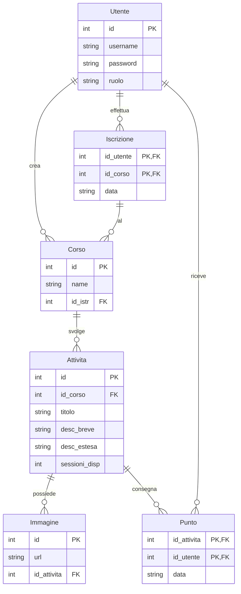

```mermaid
erDiagram
    Utente ||--o{ Corso : crea
    Utente ||--o{ Iscrizione : effettua
    Iscrizione ||--o{ Corso : al
    Corso ||--o{ Attivita : svolge
    Attivita ||--o{ Immagine : possiede
    Attivita ||--o{ Punto : consegna
    Utente ||--o{ Punto : riceve
    Utente {
        int id PK 
        string username
        string password
        string ruolo
    }
    Corso {
        int id PK
        string name
        int id_istr FK
    }
    Iscrizione {
        int id_utente PK,FK
        int id_corso PK,FK
        string data
    }
    Attivita {
        int id PK
        int id_corso FK
        string titolo
        string desc_breve
        string desc_estesa
        int sessioni_disp
    }
    Immagine {
        int id PK
        string url
        int id_attivita FK
    }
    Punto {
        int id_attivita PK,FK
        int id_utente PK,FK
        string data
    }
```
x